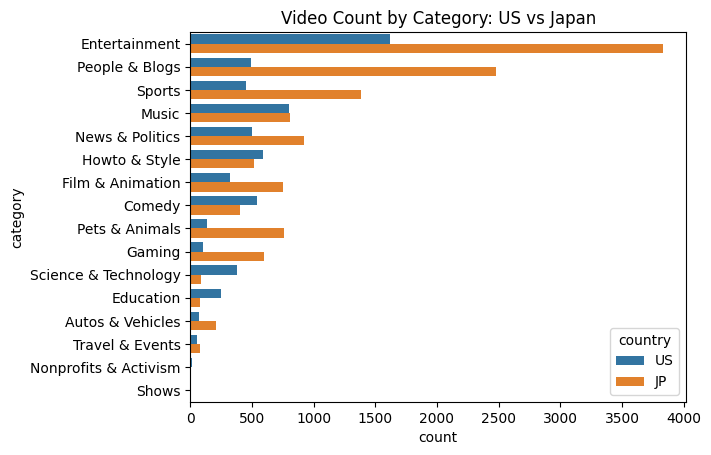
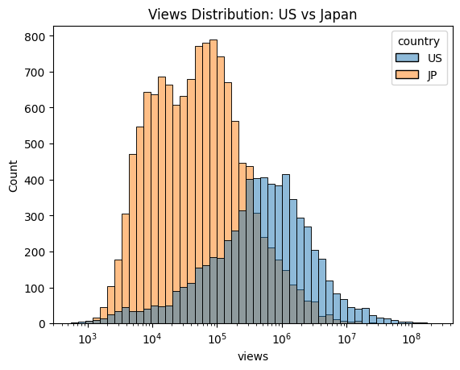
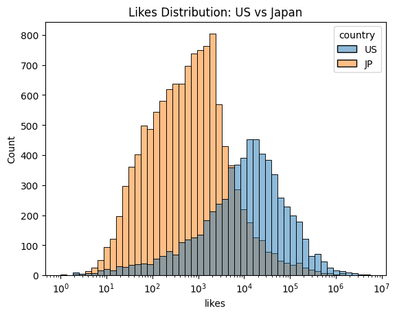
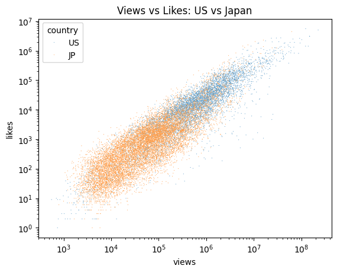
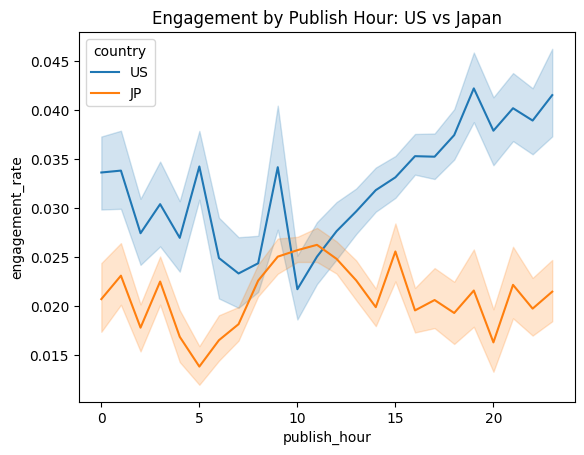
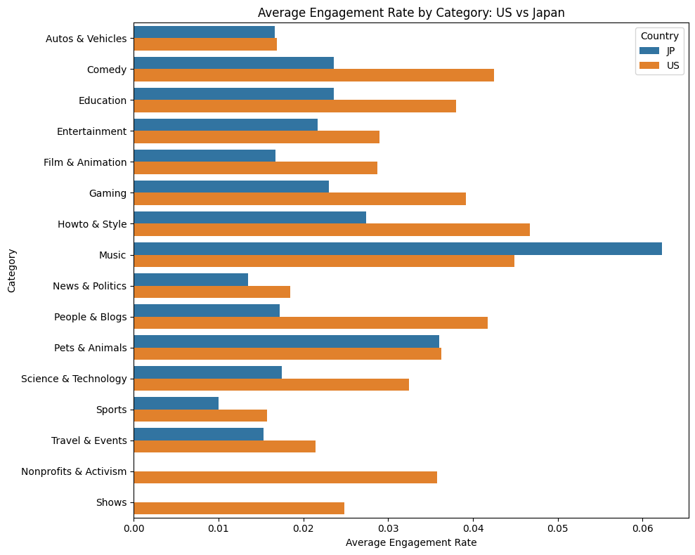

# YouTube Trending Analysis: What Drives Virality Across Markets?

This project analyzes YouTube trending video data to understand **what drives engagement and virality**, and how these patterns differ across markets (United States vs Japan).

**Key findings:**
- **Content preferences vary by market:** Entertainment-driven categories dominate in the US, while Japan shows more balanced engagement across categories.
- **User behavior differs by time:** Engagement peaks during evening hours in both markets, but patterns vary in consistency and magnitude.
- **Virality is highly skewed:** A small percentage of videos account for a disproportionate share of total views.
- **Engagement drives reach:** Videos with higher likes and comments tend to achieve significantly more views.

**Conclusion:**  
Content strategy and ranking systems should be **localized**, as engagement dynamics differ across regions.

---

## Project Overview
- Analyzed trending YouTube videos from the **US and Japan**
- Explored how **content type, timing, and engagement** impact performance
- Built a framework for **cross-market comparison**

---

## Dataset
- **Source:** Kaggle YouTube Trending Dataset  
- **Regions:** United States, Japan  

**Features:**
- Views, likes, comments  
- Publish time, trending date  
- Video category metadata  

---

## Methodology

### Data Preparation
- Cleaned and standardized datasets across countries  
- Converted timestamps to datetime format  
- Mapped category IDs to readable labels  
- Removed duplicate videos (kept highest-signal record)

### Feature Engineering
- **Engagement Rate** = (likes + comments) / views
- **Virality Score** (normalized within each country for fair comparison)

### Analysis Approach
Compared performance across:
- Content categories  
- Publish timing (hour/day)  
- Engagement and virality metrics  

---

## Key Insights

### 1. Content Strategy Should Be Market-Specific
- Top-performing categories differ across regions  
- Global platforms should avoid one-size-fits-all recommendations  

### 2. Timing Impacts Engagement
- Posting time significantly affects engagement  
- Evening hours consistently perform best  

### 3. Engagement Signals Drive Virality
- Likes and comments strongly correlate with higher view counts  
- Early engagement likely influences content ranking  

---

## Visualizations

---

## Tools & Technologies
- Python (pandas, numpy)  
- Visualization (matplotlib, seaborn)  
- Jupyter Notebook  

---

## Business Implications
- Recommendation systems should incorporate **region-specific behavior**  
- Platforms can increase engagement by **optimizing posting time guidance**  
- Early engagement signals can improve **ranking and promotion strategies**  

---

## Next Steps
- Build a predictive model for virality  
- Incorporate text features (titles, tags, sentiment)  
- Extend analysis to additional countries  